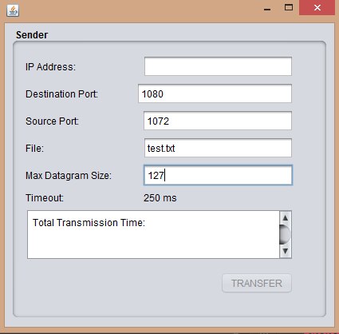
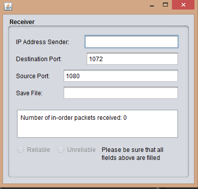
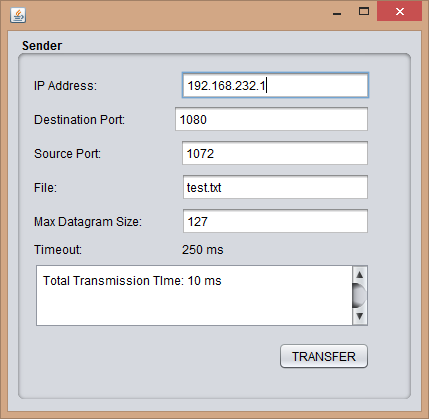
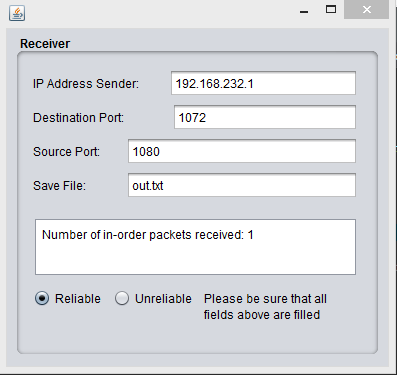
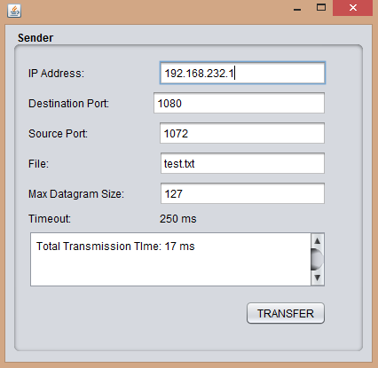
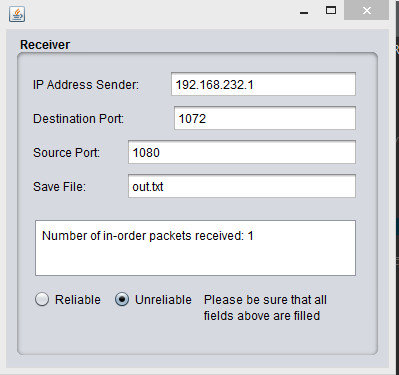
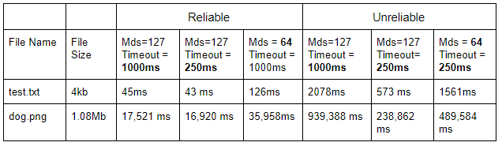

## File Transfer System 
A file transfer system programmed in Java that utilizes UDP Client and Server Connections. This system was programmed alongside another developer, Yiling Pang. This program implements both reliable and unreliable file transfer on top of the DatagramSocket API that is provided by Java. It utilizes UDP's Stop-and-Wait 3.0 Protocol. 

The program is split into two parts that runs on different end systems, Sender and Receiver, both of which are two different java programs of the same name. The purpose of this is to show the delivery of a file from the Sender to the Receiver. Both Sender and Receiver are applications presented as a GUI (Graphical User Interface). 

The Sender GUI consists of the following fields (In order from top to bottom):

 - A text field to input the IP address of the Receiver 
 - A text field to input the UDP Port number used by the receiver to receive data from the sender 
 - A text field to input the UDP Port number used by the sender to receive ACK bits from the receiver 
 - A text field to input the maximum size of the UDP datagram 
 - A "Timeout" label indicating the timeout of sessions (in ms)
 - A non-editable text field to report the total transmission time of the transfer
 - A "Transfer" button that will transfer the data to the receiver (Greyed out until all above fields are filled)

The Receiver GUI consists of the following fields (In order from top to bottom):

 - A text field to input the IP address of the Sender 
 - A text field to input the UDP Port number used by the sender to receive ACK bits from the receiver 
 - A text field to input the UDP Port number used by the receiver to receive data from the sender 
 - A text field to input the name of the output file to write the received data
 - A non-editable text field that shows the current number of received in-order packets
 - A "Reliable" and "Unreliable" option that gives the user the ability to choose whether the file transfer will be reliable or unreliable. 

The Reliable/Unreliable modes are used to simulate packet loss within the transfer. If the "Reliable" option is chosen, packets will be sent back and forth from sender to receiver with no packet losses. If the "Unreliable" option is chosen, the receiver will purposely drop every 10th packet without sending an acknowledgement (ACK) back to the sender, resulting in the sender having to re-transmit the loss packet. 

Initial connection between the Sender and Receiver is done by arranging a handshake exchange of messages. Once the Sender receives an acknowledgement from the receiver, the handshake is deemed successful. The sender will then proceed to send the chosen file in a series of datagram packets, each containing a piece of the data. The datagram packets cannot exceed the chosen size inputted in the Sender GUI. The format of the datagram packet is as follows:

 - Bytes 0 - 3: Sequence Number/Acknowledgements
 - Bytes 4 - (mds): Data of file 
 

The Receiver will acknowledge every received datagram packet by sending an ACK back back to the sender. The Receiver will also save the data that was extracted from the datagram packet into a file, using sequence numbers for proper reconstruction of the contents of the file. Once the Sender has sent all contents of the file, it will send an EOT (End of Transmission) datagram packet to the Receiver to tell it to end the transmission process. The Sender will then report the Total Transmission Time in the Total Transmission Time text field in its corresponding GUI. If the output file matches the input file, then the file was delivered with no losses. 

The process of delivery can be seen below, with the input file being a simple text file that contains the string "The test file":

For "Reliable" delivery:

For "Unreliable" delivery:

Notice how the total transmission time of the same file is different in both modes. The total transmission time is greater in the "Unreliable" mode due to the packet loss simulation done by the Receiver. 

The table below shows the transmission times of a regular text file and an image, along with different timeouts and mds values

